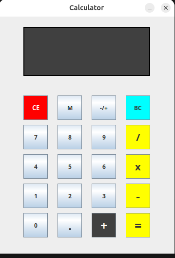

# Mini Calculatrice Java Swing

Une calculatrice simple développée en Java avec interface graphique Swing.





## Fonctionnalités

- Opérations de base (addition, soustraction, multiplication, division)
- Modulo
- Nombres négatifs
- Nombres décimaux  
- Effacement du dernier caractère (BC)
- Remise à zéro (CE)

## Interface

- Écran d'affichage avec thème sombre
- Boutons numériques 0-9
- Boutons d'opération (+, -, x, /, M)
- Boutons de contrôle (CE, BC, -/+, .)
- Bouton égal (=)

## Technologies utilisées

- Java
- Swing (GUI)
- AWT (Gestion des événements)

## Installation

1. Clonez le dépôt
2. Compilez Calculator.java
3. Exécutez la classe Calculator

```bash
javac Calculator.java
java Calculator


